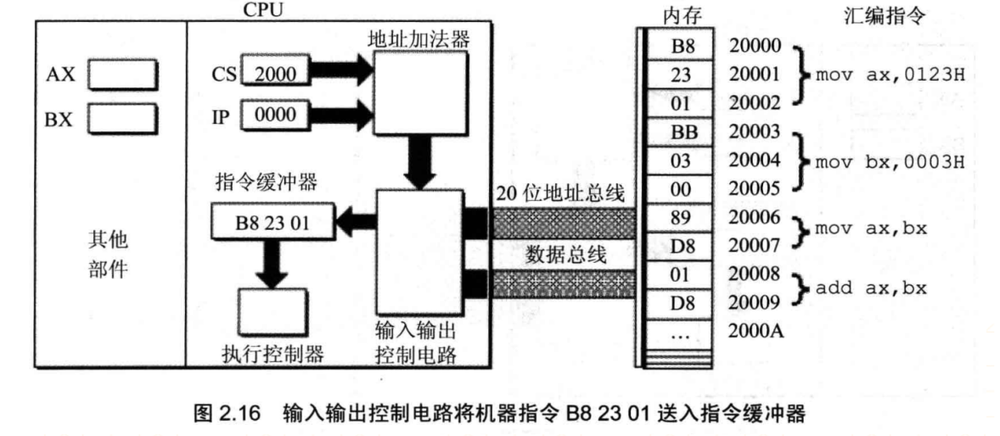
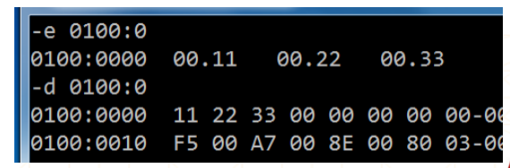
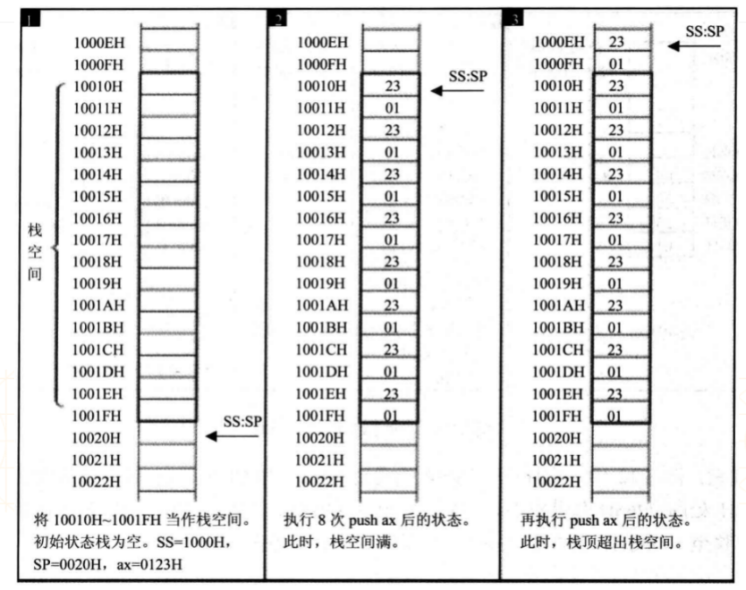

## 8086汇编

### 编程语言的发展

+ 机器语言
  - 由0和1组成
+ 汇编语言（Assembly Language）
  - 用符号代替了0和1，比机器语言便于阅读和记忆
+ 高级语言
  - C\C++\Java\Swift等，更接近人类自然语言
+ 操作：将寄存器BX的内容送入寄存器AX
  - 机器语言：1000100111011000
  - 汇编语言：mov ax, bx
  - 高级语言：ax = bx;

### 编程语言的发展


+ **汇编语言**与**机器语言**一一对应，每一条机器指令都有与之对应的汇编指令
+ **汇编语言**可以通过编译得到**机器语言**，机器语言可以通过反编译得到汇编语言
+ 高级语言可以通过编译得到汇编语言\机器语言，但汇编语言\机器语言几乎不可能还原成高级语言


### 汇编语言的特点

+ 可以直接访问、控制各种硬件设备，比如存储器、CPU等，能最大限度地发挥硬件的功能
+ 汇编指令是机器指令的助记符,同机器指令一一对应。每一种CPU都有自己的机器指令集\汇编指令集，所以汇编语言不具备可移植性
+ 知识点过多，开发者需要对CPU等硬件结构有所了解，不易于编写、调试、维护
+ 不区分大小写，比如mov和MOV是一样的


### 汇编语言 VS 高级语言

+ 采用高级语言C++和汇编语言编写同一个功能

  - 将a+b的结果赋值给c，然后在屏幕上打印c的结果
  - 因为c++需要链接各种库，所以可执行文件的比较大

  

  


### 汇编语言的用途（为什么要学习汇编语言？）

+ 编写驱动程序、操作系统（比如Linux内核的某些关键部分）
+ 对性能要求极高的程序或者代码片段，可与高级语言混合使用（内联汇编）
+ 软件安全
  - 病毒分析与防治
  - 逆向\加壳\脱壳\破解\外挂\免杀\加密解密\漏洞\黑客
+ 是理解整个计算机系统的最佳起点和最有效途径
+ 为编写高效代码打下基础
+ 弄清代码的本质
  - sizeof
  - ++a + ++a + ++a
  - switch和if的效率究竟谁高？为什么？
  - 很多理论和说法是扯淡


### 汇编语言的种类

+ 目前讨论比较多的汇编语言有
  - 8086汇编（8086处理器是16bit的CPU）
  - Win32汇编
  - Win64汇编
  - AT&T汇编（Mac、iOS模拟器）
  - ARM汇编（嵌入式、iOS设备）
  - ......
+ 入门建议先从学些8086汇编开始
  - 结构简洁、经典
  - 参考书籍：王爽《汇编语言》

### 学前须知

+ 要想学好汇编语言，首先要对CPU等硬件结构有一定的了解

+ 软件\程序的执行过程

  

+ 最为关键的是需要了解CPU和内存

+ 在学习汇编语言过程中，遇到的绝大部分指令都是跟内存、CPU有关的

### 总线

+ 每一个CPU芯片都有许多管脚，这些管脚和总线相连，CPU通过总线跟外部器件进行交互

+ 总线：一根根导线的集合，每根导线有1，0两种信号。n条导线，总的信号集合为 2<sup>n</sup>。

  

+ 总线的分类

  - 地址总线
    - 它的宽度决定了CPU**寻址能力**
    
    - 8086的地址总线宽度为**20**, 所以寻址能力是**1M(2<sup>20</sup>)**
    
      ```
      共有2的20次方个地址
      其总的内存空间大小为  2的20次方*B
      因为每一个地址的对应空间的大小都是1个字节
      ```
    
      
    
      
  - 数据总线
    - 它的宽度决定了CPU的单次数据传送量，也就是**数据传送速度**
    - 8086的数据总线为**16**，所以单次最大传递**2个字节**的数据
  - 控制总线
    
    - 它的宽度决定了CPU对其他器件的**控制能力**，能有多少种控制

  

+ CPU从内存的3号单元读取数据

  

  1. 地址总线将地址3传送过去，用来寻址
  2. 控制总线传递读的命令
  3. 数据总线将地址3的数据8传递给cpu

+ CPU从内存的3号单元写数据
  1. 地址总线将地址3传送过去，用来寻址
  2. 控制总线传递写的命令
  3. 数据总线将数据8传递给地址3

### 数据总线

+ 8088的数据总线宽度是8，8086的数据总线宽度是16，分别向内存中写入89D8H

  

### 思考


### 内存

+ 各类存储器的逻辑连接情况

  

+ 所有的内存单元都有唯一的地址, 叫做物理地址

+ 各类存储器的物理地址情况

  - 内存地址空间的大小受CPU地址总线宽度的限制。8086的地址总线宽度为20，可以定位2<sup>20</sup>个不同的内存单元（内存地址范围0x00000~0xFFFFF），所以8086的内存空间大小为1MB
  - 0x00000~0x9FFFF：主存储器。可读可写
  - 0xA0000~0xBFFFF：向显存中写入数据，这些数据会显卡输出到显示器。可读可写
  - 0xC0000~0xFFFFF: 存储各种硬件\系统信息。只读

  

+ 下图是各类存储器的逻辑连接-物理地址对应图

  

### 8086的寻址方式

+ CPU访问内存单元时，要给出内存单元的地址

+ 8086有**20位**地址总线，可以传送**20位**的地址，**1M**的寻址能力

  

+ 但它又是**16位**结构的CPU，它内部能够一次性处理、传输、暂时存储的地址为**16位**。如果将地址从内部简单地发出，那么它只能送出**16位**的地址，表现出来的寻址能力只有64KB

+ 8086采用一种在内部用**2个16位地址**合成的方法来生成**1个20位的物理地址**

  

+ 地址加法器采用**物理地址 = 段地址x16+偏移地址**的方法用段地址和偏移地址合成物理地址。

  - 例如8086CPU要访问地址为123C8H的内存单元，此时，地址加法器的工作过程

    

    

### 内存的分段管理

+ 8086是用`起始地址（段地址×16） + 偏移地址 = 物理地址`的方式给出物理地址

+ 为了开发方便，我们可以采取分段的方法来管理内存，比如：

  - 地址10000H~100FFH的内存单元组成一个段，该段的**起始地址**为10000H，**段地址**为1000H，大小为100H

  - 地址10000H~1007FH、10080H~100FFH的内存单元组成2个段，它们的**起始地址**为：10000H和10080H，**段地址**为1000H和1008H，大小都为80H

    

+ **偏移地址**为16位，16位地址的寻址能力为64KB，所以一个段的长度最大为64KB

  

### CPU的典型构成


+ 对程序员来说，CPU中最主要部件是寄存器，可以通过改变寄存器的内容来实现对CPU的控制

+ 不同的CPU，寄存器的个数、结构是不相同的（8086是16位结构的CPU）

+ 8086有14个寄存器

  - 都是16位的寄存器
  - 可以存放2个字节

  

  

### 通用寄存器

+ AX、BX、CX、DX这4个寄存器通常用来存放一般性的数据，称为通用寄存器（有时也有特定用途）

+ 通常，CPU会先将内存中的数据存储到通用寄存器中，然后再对通用寄存器中的数据进行运算

+ 假设内存中有块红色内存空间的值是3，现在想把它的值加1，并将结果存储到蓝色内存空间

  - CPU首先会将红色内存空间的值放到AX寄存器中：mov ax,红色内存空间

    

  - 然后让AX寄存器与1相加：add ax,1

    

  - 最后将值赋值给内存空间：mov 蓝色内存空间,ax

    

    

+ AX、BX、CX、DX这4个通用寄存器都是16位的，如下图所示

  

+ 上一代8086的寄存器都是8位的，为了保证兼容， AX、BX、CX、DX都可分为2个独立的8位寄存器来使用

  - H代表高位寄存器

  - L代表低位寄存器

    

    

### 字节与字

+ 在汇编的数据存储中，有2个比较常用的单位
  - 字节：byte，1个字节由8bit组成，可以存储在8位寄存器中
  - 字：word，1个字由2个字节组成，这2个字节分别称为字的高字节和低字节
+ 比如数据20000（4E20H，01001110  00100000B），高字节的值是78，低字节的值是32
+ 1个字可以存在1个16位寄存器中，这个字的高字节、低字节分别存储在这个寄存器的高8位寄存器、低8位寄存器

### 段寄存器

+ 8086在访问内存时要由相关部件提供内存单元的**段地址**和**偏移地址**，送入地址加法器合成**物理地址**

+ 是什么部件提供段地址？**段地址**在8086的**段寄存器**中存放

+ 8086有**4个段寄存器**：CS、DS、SS、ES，当CPU需要访问内存时由这**4个段寄存器**提供内存单元的段地址

  - CS (Code Segment)：代码段寄存器
  - DS (Data Segment)：数据段寄存器
  - SS (Stack Segment)：堆栈段寄存器
  - ES (Extra Segment)：附加段寄存器

  

### CS和IP

+ CS为代码段寄存器，IP为指令指针寄存器，**它们指示了CPU当前要读取指令的地址**
+ 任意时刻，8086CPU都会将CS:IP指向的指令作为下一条需要取出执行的指令


### 指令的执行过程





+ 通过上面的过程展示，8086工作过程如下
  1. 从`CS:IP`指向的内存单元读取指令，读取的指令进入指令缓存区
  2. `IP=IP+所读取的指令的长度`, 从而指向下一条指令
  3. 执行指令。转到步骤(1)，重复这个过程。

+ 在8086CPU加电启动或复位后(即CPU刚开始工作时)CS和IP被设置为CS=FFFFH, IP=0000H,即

  在8086PC机刚启动时，CPU从内存FFFF0H处读取指令执行，FFFF0H单元中的指令是8086PC机

  开机后执行的第一条指令

### 指令和数据

+ 在内存或者磁盘上，指令和数据没有任何区别，都是二进制信息

+ CPU在工作的时候把有的信息看做指令，有的信息看做数据，为同样的信息赋予了不同的意义

  

+ CPU根据什么将内存中的信息看做指令？
  - CPU将CS:IP指向的内存单元的内容看做指令
  - 如果内存中的某段内容曾被CPU执行过，那么它所在的内存单元必然被CS:IP指向过

### jmp指令

+ CPU从何处执行指令是由CS、IP中的内容决定的，我们可以通过改变CS、IP的内容来控制CPU执行目标指令

+ 8086提供了一个`mov`指令（`传送指令`），可以用来修改`大部分寄存器`的值，比如

  - mov ax,10、mov bx,20、mov cx,30、mov dx,40

+ 但是，mov指令**不能**用于设置CS、IP的值，8086没有提供这样的功能

+ 8086提供了另外的指令来修改CS、IP的值，这些指令统称为转移指令，最简单的是jmp指令

  - 若想同时修改CS,IP的内容，可用形如`jmp 段地址:偏移地址`的指令完成

    

  - 若想仅修改IP的内容，可用形如`jmp 某一合法寄存器`的指令完成

    

  - 另外，也可以“jmp 直接值”来改变IP的值，比如“jmp 0100H”

+ 练习

  

  

### Debug(了解)

#### 什么是Debug

Debug是DOS， Windows都提供的实模式程序的调试工具，使用它，可以查看CPU各种寄存器

中的内容，内存的情况和机器码级跟踪程序的运行


#### 打开Debug

+ Windows键 + R，输入debug

  

+ 也可以先进入cmd，再输入debug

+ 注意：debug里面的数值默认都是采用16进制


#### Debug的常用功能

+ R命令查看，改变CPU寄存器的内容
+ D命令查看内存中的内容
+ E命令改写内存中的内容
+ U命令将内存中的机器指令翻译成汇编指令
+ T命令执行一条机器指令
+ A命令以汇编指令的格式在内存中写入一条机器指令
+ q命令退出debug
+ p命令类似于step over(t命令类似于step into)，可用于跳过loop循环
+ g命令跳过前面的代码，停留在指定的代码位置

#### R命令

+ 输入“r”可以查看所有寄存器的值

+ 输入“r 寄存器名称”可以修改寄存器的值

+ 输入“r ax”将ax寄存器的值改为0100H

  

#### D命令

+ 输入“d”可以查看内存中的内容

+ 输入“d 段地址:偏移地址”查看特定位置的内存数据

+ 输入“d 段地址:起始偏移地址 结尾偏移地址”查看特定位置和特定范围的内存数据

+ 输入“d 偏移地址”、 “d 起始偏移地址 结尾偏移地址” ，会将DS的内容作为段地址

  

  - 右边是每个内存单元中的数据对应的可显示的ASCII码
  - 如果没有对应的ASCII字符，就显示`.`

#### E命令

+ 输入“e 段地址:偏移地址 数据串”修改特定位置的内存数据

  

+ 输入“e 段地址:偏移地址”后按Enter也可以修改特定位置的内存数据，数据之间用空格隔开

  

  

#### U命令

+ 输入“u”、“u 段地址:偏移地址”可以将内存中的内容翻译为对应的汇编指令

  

+ 由3部分组成

  - 最左边一列：是指令的地址“段地址:偏移地址”
  - 中间那一列：是指令对应的机器指令
  - 最右边一列：是汇编指令

#### A命令

+ 输入“a ”、“a 段地址:偏移地址”可以从某位置开始写入汇编指令

  

#### 练习


### DS和[address]

+ CPU要读写一个内存单元时，必须要先给出这个内存单元的地址，在8086中，内存地址由段地址和偏移地址组成

+ 8086中有一个DS段寄存器，通常用来存放要访问数据的段地址。

  

  + 上面3条指令的作用将10000H（1000:0）中的内存数据赋值到al寄存器中
  + mov al,[address]的意思将DS:address中的内存数据赋值到al寄存器中
  + 由于al是8位寄存器，所以是将一个字节的数据赋值给al寄存器

+ 8086不支持将数据直接送入段寄存器中，mov ds,1000H是错误的

+ 将al中的数据送到内存单元中

  ```assembly
  mov bx, 1000H
  mov ds, bx
  mov [0], al
  ```

### 字型数据的传递（2个字节）

+ 写出下面指令执行后寄存器ax,bx,cx中的值

  

  

### 大小端

+ 大端模式，是指数据的高字节保存在内存的低地址中，而数据的低字节保存在内存的高地址中（高低\低高） (Big Endian)

+ 小端模式，是指数据的高字节保存在内存的高地址中，而数据的低字节保存在内存的低地址中（高高\低低） (Little Endian)

  

```
Big Endian: PowerPC, IBM, Sun
Little Endian: x86, DEC
ARM既可以工作在大端模式，也可以工作在小端模式。一般是小端模式
```


### mov指令


+ `mov 内存单元, 内存单元`是不允许的，比如`mov [0], [1]`


### add和sub指令


### 指令要处理的数据长度

+ 8086指令能处理2种尺寸的数据：byte、word
+ 思考：“mov [0], 20H”指令是否正确？
  + mov byte ptr [0], 20H	将20H放入0位置内存的字节单元，占用1个字节
  + mov word ptr [0], 20H	将20H放入0位置内存的字单元，占用2个字节

+ 很多指令都可以通过“byte ptr”或者“word ptr”来指明所需要操作内存的数据长度
  - inc byte ptr [0]
  - add word ptr [0], 2
+ 有些指令有默认的操作数据长度，比如push [0]、pop [0]的操作数据长度只能是2个字节

### 栈

+ 栈：是一种具有特殊的访问方式的存储空间（后进先出， Last In Out Firt，LIFO）

  

+ 8086会将`CS`作为`代码段`的段地址，将`CS:IP`指向的指令作为`下一条需要取出执行的指令`

+ 8086会将`DS`作为`数据段`的段地址，mov ax,[address]就是取出DS:address的内存数据放到ax寄存器中

+ 8086会将SS作为栈段的段地址，任意时刻，SS:SP指向栈顶元素

+ 8086提供了`PUSH`（入栈）和`POP `（出栈）指令来操作栈段的数据

  - 比如push ax是将ax的数据入栈，pop ax是将栈顶的数据送入ax

+ 栈空时，SS:SP指向栈空间最高地址单元的下一个单元

  

### push ax


+ push ax的执行，由以下两步完成
  1. `SP=SP-2`, `SS:SP`指向新的栈顶
  2. 将ax中的内容送入`SS:SP`指向的内存单元， `SS:SP`此时指向新的栈顶

### pop ax


+ pop ax的执行过程和push ax刚好相反
  1. 将`SS:SP`指向的内存单元处的数据送入ax中
  2. `SP=SP+2`,`SS:SP`指向新的栈顶

### 栈顶超界

#### 栈顶超界-push



#### 栈顶超界-pop


#### 栈顶超界的注意


### push-pop

+  在8086中，push、pop操作的数据都是2个字节的

  

+ 练习

  

  ```assembly
  ;设置栈段地址
  mov ax, 1000H
  mov ss, ax
  ;设置栈顶指针
  mov sp, 0010h
  
  mov ax, 001AH
  mov bx, 001BH
  
  push ax
  push bx
  
  pop ax
  pop bx
  ```

### 段的总结


### 第一个完整的汇编程序

+ 使用汇编语言编写一个完整的程序，步骤大致如下

  - 编写源代码，文件名拓展名为.asm
  - 编译、链接（可以使用微软的MASM编译器）
  - 调试、运行

  

### 汇编语言的组成

+ 汇编语言由2类指令组成

  - 汇编指令
    - 如mov、add、sub等
    - 有对应的机器指令，可以被编译为机器指令，最终被CPU执行
  - 伪指令
    - 如assume、 segment、ends、end等
    - 没有对应的机器指令，由编译器解析，最终不被CPU执行

+ 注释以分号开头

  

### 伪指令 – segment、ends、end

+ segment和ends的作用是定义一个段，segment代表一个段的开始，ends代表一个段的结束，使用格式为

  ```assembly
  段名 segment
  ...
  ...
  段名 ends
  ```

+ 一个有意义的汇编程序中，至少要有一个段作为代码段存放代码

  - assume
    - 声明一下code段是cs段、代码段
  - end
    - 编译器遇到end时，就结束对源程序的编译


### 退出程序

+ 下面2句代码的作用是退出程序

  ```assembly
  mov ah, 4ch
  int 21h
  ```

+ 也可以写成

  ```assembly
  mov ax, 4c00h
  int 21h
  ```

### 中断

+ 中断是由于软件的或硬件的信号，使得CPU暂停当前的任务，转而去执行另一段子程序
+ 也就是说，在程序运行过程中，系统出现了一个必须由CPU立即处理的情况，此时，CPU暂时中止当前程序的执行转而处理这个新情况的过程就叫做中断
+ 中断的分类
  - 硬中断（外中断），由外部设备(比如网卡、硬盘)随机引发的，比如当网卡收到数据包的时候，就会发出一个中断
  - 软中断（内中断），由执行中断指令产生的，可以通过程序控制触发
+ 从本质上来讲，中断是一种电信号，当设备有某种事件发生时，它就会产生中断，通过总线把电信号发送给中断控制器。如果中断的线是激活的，中断控制器就把电信号发送给处理器的某个特定引脚。处理器于是立即停止自己正在做的事，跳到中断处理程序的入口点，进行中断处理
+ 可以通过指令`int n`产生中断
  - `n`是中断码，内存中有一张中断向量表，用来存放中断码对应中断处理程序的入口地址
  - CPU在接收到中断信号后，暂停当前正在执行的程序，跳转到中断码对应的中断向量表地址处，去执行中断处理程序
+ 常见中断
  - `int 10h`用于执行BIOS中断
  - `int 3`是“断点中断”，用于调试程序
  - `int 21h`用于执行DOS系统功能调用，AH寄存器存储功能号


### DOS系统功能调用

+ DOS系统功能调用

  - 由DOS提供的一组实现特殊功能的子程序供程序员在编写自己的程序时调用，以减轻编程的工作量

  - 涉及屏幕显示、文件管理、I/O管理等等

  - 子程序的调用规则参考资料中的`《DOS系统功能调用表(int 21h)》`

  - 每个子程序都有一个功能号，所有的功能调用的格式都是一致的。调用的步骤大致如下

    - 系统功能号送到寄存器AH中
    - 入口参数送到指定的寄存器中；
    - 用INT 21H指令执行功能调用；
    - 根据出口参数分析功能调用执行情况。

    

### emu8086常用快捷键

+ F5：调试运行
+ F4：重新加载
+ F8：下一步（单步执行）
+ F9：直接一步到位运行整个程序
+ Ctrl + F8：跳过前面代码，断点到单击选中的代码那行
+ 注意：emu8086的语法检查并非100%严格（比较严谨的还是使用MASM进行编译）

### loop指令

+ loop指令和cx配合使用，用于循环执行重复的操作，类似于高级语言中的for、while循环

+ 使用格式

  ```assembly
  mov cx, 循环次数
  标号:
      循环执行的程序段
      loop 标号
  ```

+ loop指令的执行流程

  1. 让cx的值减一，即cx = cx – 1

  2. 判断cx的值
     - 如果不为零转至标号处执行程序，然后重复1
     - 如果为零则执行loop后面的代码

+ 使用示例

  

### 段前缀

+ `mov ax, [bx]`中bx的值是偏移地址，段地址默认在ds中
+ 我们也可以明确地标明段地址，比如
  - mov ax, ds:[bx]
  - mov ax, cs:[bx]
  - mov ax, ss:[bx]
  - mov ax, es:[bx]
+ 上面的`ds:`、`cs:`、`ss:`、`es:`称为段前缀

### 在代码段中存放数据

+ 计算1122h、3344h、5566h的和，结果存放在ax中

+ dw（define word）

  - 使用dw定义了3个字型数据，数据之间用逗号隔开
  - 类似的还有db（define byte）、dd（define double word）

+ start和end start是对应的， start标记程序的执行入口

  

### 包含多个段的程序

+ 如果将代码、数据、栈都放到一个段里面

  - 会显得混乱，编程时要随时注意何处是数据、何处是栈、何处是代码
  - 一个段的大小<=64KB，这样就会让数据、代码、栈的大小受到极大的限制

+ 所以，一般会考虑使用多个段来存放数据、代码、栈

  

### 给数据起标号


### 不同的寻址方式


### call和ret指令

+ call 标号：
  - **将下一条指令的偏移地址入栈后**
  - **转到标号处执行指令**
+ ret：**将栈顶的值出栈，赋值给ip**

+ call和ret联合使用的作用其实就是高级语言中的函数调用
+ 实践，考虑以下几种情况
  - 有无参数
  - 有无返回值
  - 现场保护
  - 局部变量
  - 堆栈平衡


### 代码段+数据段

```assembly
;这一句是告诉开发者，哪个地方是代码段，哪个地方是数据段
;cs寄存器的设置是通过start来自动设置的。ds寄存器的设置要手动设置
assume cs:code, ds:data
; ----- 数据段 begin ----- 
data segment   
    ;为20h设置别名age
    age db 20h
    no dw 30h 
    db 10 dup(6) ; 生成10个连续的6, db->define byte
    string db 'Hello World!$' ;字符串以$结尾
data ends  
; ----- 数据段 end ----- 


; ----- 代码段 begin ----- 
code segment  
start:     
    ; 手动设置ds的值
    mov ax, data
    mov ds, ax
    
    mov ax, no
    mov bl, age

    ; 打印
    mov dx, offset string 
    ; offset string代表string的偏移地址   
    ;打印程序
    mov ah, 9h
    int 21h 
    ; 退出
    mov ax, 4c00h
    int 21h    
code ends
; ----- 代码段 end -----    
end start
; 编译结束，start是程序入口
; start所在的段就是代码段
; 所以cs的值就是code段的段地址
; 相当于cs的值已经自动设置完毕
```


### 代码段+数据段+ 栈段

```assembly
assume cs:code, ds:data, ss:stack
; 栈段
stack segment   
   
    db 10 dup(8)
stack ends 

; 数据段
data segment   
    db 20 dup(9)
data ends 
; 代码段
code segment
start: 
    ; 手动设置ss和ds
    mov ax, stack
    mov ss, ax   
    mov ax, data
    mov ds, ax

    mov ax, 1122h
    mov bx, 3344h  
    
    mov [0], ax
    
    ; 使用栈, 开辟10个字节的空间
    mov sp, 10 
    ;ax, bx中的值入栈
    push ax
    push bx
    pop ax ;将栈顶的元素出栈，并放到ax中
    pop bx ;将栈顶的元素出栈，并放到bx中

    ; 退出
    mov ax, 4c00h
    int 21h   
code ends
end start
```


### 函数的返回值

+ 函数的返回值默认放在ax寄存器中

```assembly
assume cs:code, ds:data, ss:stack

; 栈段
stack segment
    db 100 dup(0)
stack ends  


; 数据段
data segment  
    a dw 0
    db 100 dup(0) 
    string db 'Hello!$'
data ends


; 代码段
code segment
start:
    ; 手动设置ds、ss的值
    mov ax, data
    mov ds, ax
    mov ax, stack
    mov ss, ax  
    
    ; 业务逻辑 
    call mathFunc3
    
    mov bx, ax  
    
    ; 退出
    mov ax, 4c00h
    int 21h 
    
; 返回2的3次方
; 返回值放到ax寄存器中     
mathFunc3:  
    mov ax, 2
    add ax, ax
    add ax, ax 
    ret          
code ends  

end start
```

### 函数的参数

+ 将传入的参数值通过push的方式放到栈中
+ 然后使用的时候从栈中取出参数值

```assembly
assume cs:code, ds:data, ss:stack

; 栈段
stack segment
    db 100 dup(0)
stack ends  

; 数据段
data segment  
    db 100 dup(0) 
data ends


; 代码段
code segment
start:
    ; 手动设置ds、ss的值
    mov ax, data
    mov ds, ax
    mov ax, stack
    mov ss, ax  
    
    ; 业务逻辑
    push 1122h ;通过push将参数放到栈中
    push 3344h 
    call sum1 ;调用函数
    add sp, 4; 恢复栈平衡(外平栈)
    
    ; 退出
    mov ax, 4c00h
    int 21h 
    
; 返回值放ax寄存器
; 传递2个参数(放入栈中)    
sum1:   
    ; 访问栈中的参数
    mov bp, sp
    mov ax, ss:[bp+2]
    add ax, ss:[bp+4]
    ret 
                
code ends  

end start
```

### 栈平衡

```assembly
assume cs:code, ds:data, ss:stack

; 栈段
stack segment
    db 100 dup(0)
stack ends  


; 数据段
data segment  
    db 100 dup(0) 
data ends


; 代码段
code segment
start:
    ; 手动设置ds、ss的值
    mov ax, data
    mov ds, ax
    mov ax, stack
    mov ss, ax  
    
    ; 业务逻辑
    push 1122h
    push 3344h 
    call sum
    add sp, 4  ;外平栈
    
    push 1122h
    push 3344h  
    call minus ;内平栈
    
    ; 退出
    mov ax, 4c00h
    int 21h 
    
; 返回值放ax寄存器
; 传递2个参数(放入栈中)    
sum:   
    ; 访问栈中的参数
    mov bp, sp
    mov ax, ss:[bp+2]
    add ax, ss:[bp+4]
    ret 
        
; 返回值放ax寄存器
; 传递2个参数(放入栈中)   
minus:
    mov bp, sp 
    mov ax, ss:[bp+2]
    sub ax, ss:[bp+4]
    ret 4
 code ends  

end start

; 栈平衡：函数调用前后的栈顶指针要一致
; 栈如果不平衡的结果：栈空间迟早会被用完

; 栈平衡的方法
; 1.外平栈
;    push 1122h
;    push 3344h 
;    call sum
;    add sp, 4 
; 2.内平栈
;    ret 4
```


### 函数调用的本质

1. 参数：push 参数值
2. 返回值：返回值存放到ax中
3. 栈平衡

```assembly
assume cs:code, ds:data, ss:stack

; 栈段
stack segment
    db 100 dup(0)
stack ends  


; 数据段
data segment  
    db 100 dup(0) 
data ends


; 代码段
code segment
start:
    ; 手动设置ds、ss的值
    mov ax, data
    mov ds, ax
    mov ax, stack
    mov ss, ax  
    
    ; 业务逻辑
    push 1111h
    push 2222h 
    push 3333h 
    call sum
    add sp, 6     
    
    ; 退出
    mov ax, 4c00h
    int 21h 
    
; 返回值放ax寄存器
; 传递2个参数(放入栈中)    
sum:   
    ; 访问栈中的参数
    mov bp, sp
    mov ax, ss:[bp+2]
    add ax, ss:[bp+4]
    add ax, ss:[bp+6]  
    
    ret  
                
code ends  

end start
```


### 函数的调用约定

+ __cdecl: 外平栈，参数从右至左入栈

  ```c
  int __cdecl sum(int a, int b) {
     return a + b;
  }
  ```

  

+ __stdcall: 内平栈，参数从右至左入栈

  ```c
  int __stdcall sum(int a, int b) {
     return a + b;
  }
  ```

+ __fastcall: 内平栈，ecx, edx分别传递前面2个参数，其他参数从右至左入栈

  ```c
  int __fastcall sum(int a, int b) {
     return a + b;
  }
  //通过寄存器传递参数，速度更快
  ```


### 完整的函数调用流程

```assembly
assume cs:code, ds:data, ss:stack

; 栈段
stack segment
    db 100 dup(0)
stack ends  

; 数据段
data segment  
    db 100 dup(0) 
data ends

; 代码段
code segment
start:
    ; 手动设置ds、ss的值
    mov ax, data
    mov ds, ax
    mov ax, stack
    mov ss, ax 
    
    mov si, 1
    mov di, 2
    mov bx, 3 
    mov bp, 4
    
    ; 业务逻辑
    push 1
    push 2 
    call sum 
    add sp, 4 
    
    ; 退出
    mov ax, 4c00h
    int 21h 
    
; 返回值放ax寄存器
; 传递2个参数(放入栈中)    
sum:
    ; 保护bp：将bp之前的值入栈，并将sp=sp-2
    push bp
    ; 保存sp之前的值：指向bp以前的值
    mov bp, sp
    ; 预留10个字节的空间给局部变量 
    sub sp, 10
    
    ; 保护可能会用到的寄存器
    push si
    push di
    push bx 

    ; 给局部变量空间填充int 3（CCCC）
    ; 填充分配的局部变量空间，让局部变量更加安全，windows填充cc,是int 3断点中断，一旦程序异常，执行断点中断
    ; stosw的作用：将ax的值拷贝到es:di中,同时di的值会+2
    mov ax, 0cccch
    ; 让es等于ss
    mov bx, ss
    mov es, bx 
    ; 让di等于bp-10（局部变量地址最小的区域）
    mov di, bp
    sub di, 10   
    ; cx决定了stosw的执行次数
    mov cx, 5  
    rep stosw  
    ; rep的作用：重复执行某个指令（执行次数由cx决定）
     
     
    ; -------- 业务逻辑 - begin
    ; 定义2个局部变量
    mov word ptr ss:[bp-2], 3 
    mov word ptr ss:[bp-4], 4 
    mov ax, ss:[bp-2]
    add ax, ss:[bp-4]
    mov ss:[bp-6], ax 
    
    ; 访问栈中的参数
    mov ax, ss:[bp+4]
    add ax, ss:[bp+6] 
    add ax, ss:[bp-6]   
    ; -------- 业务逻辑 - end 
    
    ; 恢复寄存器的值
    pop bx
    pop di
    pop si
                       
    ; 恢复sp
    mov sp, bp
    ; 恢复bp: 此时bp变为原来的值，并且将sp=sp+2， sp指向返回地址
    pop bp
    ; 将栈顶的返回地址出栈，赋值给ip,并且将sp=sp+2
    ; 此时sp指向参数区域的顶部区域，然后通过外平栈sub sp, 4，达到栈平衡
    ret 
code ends  

end start

; 函数的调用流程（内存）
; 1.push 参数
; 2.push 函数的返回地址
; 3.push bp （保留bp之前的值，方便以后恢复）
; 4.mov bp, sp （保留sp之前的值，方便以后恢复）
; 5.sub sp,空间大小 （分配空间给局部变量）
; 6.保护可能要用到的寄存器
; 7.使用CC（int 3）填充局部变量的空间  

; 8.--------执行业务逻辑--------      

; 9.恢复寄存器之前的值
; 10.mov sp, bp （恢复sp之前的值）
; 11.pop bp （恢复bp之前的值）
; 12.ret （将函数的返回地址出栈，执行下一条指令）
; 13.恢复栈平衡 （add sp,参数所占的空间）
```


### 栈帧

+ 栈帧: (stack frame layout)

  - 就是一个函数的执行环境

  - 在本函数中的操作(理解见仁见智)

  - 在本函数调用进入其他函数时，入参，以及存放返回地址，仍然属于当前栈帧。

  - 进入其他函数后不属于当前函数栈帧

    

    

### JCC和标志寄存器

+ 将结果放到标志寄存器中

+ 然后通过jcc实现指令的跳转

  

+ 测试代码

  ```assembly
  assume cs:code, ds:data, ss:stack
  
  ; 栈段
  stack segment
      db 100 dup(0)
  stack ends  
  
  ; 数据段
  data segment  
      db 100 dup(0) 
  data ends
  
  ; 代码段
  code segment
  start:
      ; 手动设置ds、ss的值
      mov ax, data
      mov ds, ax
      mov ax, stack
      mov ss, ax 
   
      mov ax, 11
      mov bx, 11
      sub ax, bx
      
      je sum
      
      ; 退出
      mov ax, 4c00h
      int 21h 
        
  sum:
    mov ax, 1122h
  ret
  code ends  
  
  end start
  ```

  

